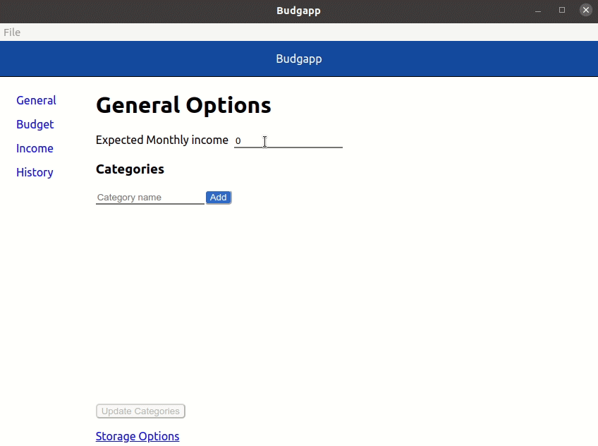

# budgapp
Bugapp is a simple application for tracking and managing a budget. for more information see [about](./doc/About.md).

## Running
You can run budgapp in either a development or production mode. 

### Developer
To run in developer mode run the following command `yarn run start`.

While in developer mode changes to the web content will auto reload. However, changes to the electron app will require another start.

### Production
To run in production mode run the following command `yarn run prod`. This runs the app in a similar fashon as to how it would be deployed.

## Testing
Budgapp has both unit and end-to-end tests. To run all unit tests run `yarn run test:ci`. To run end-to-end tests run `yarn run test:e2e`.