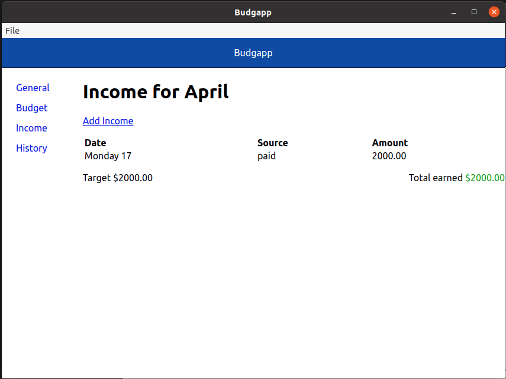
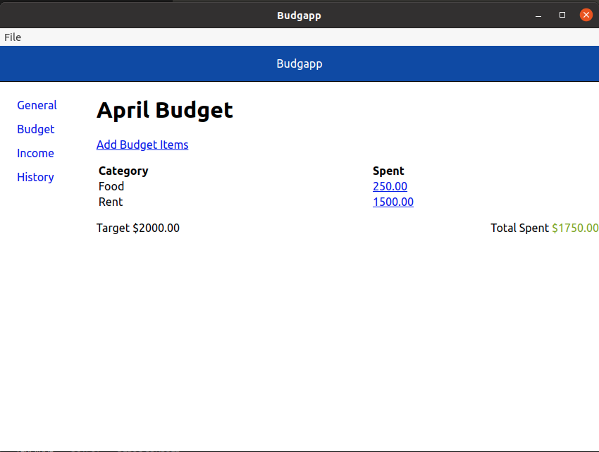

# About
Bugapp is a simple application for tracking and managing a budget. This application is limited to the things I have found useful for tracking a budget.

## Features
* Income and expense tracking
* expense tracking across different categories
* Historical view of how money is managed.

### Income Tracking
Income can be entered and tracked over time

### Spending Tracking
Spending can be entered and tracked in a similar way to income. You can also track how you are spending money based off of categories you define.

### Viewing How money is spent over time
You can get a historical break down of your income verses your spending.
