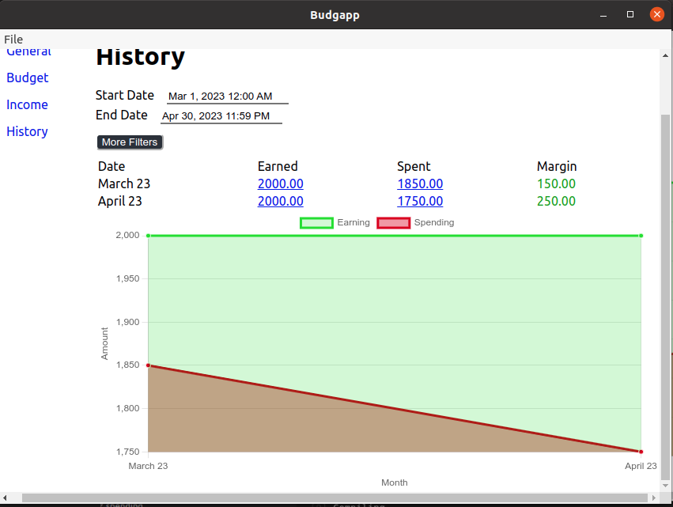

# About
Bugapp is a simple application for tracking and managing a budget. This application is limited to the things I have found useful for tracking a budget.

## Features
* Income and expense tracking
* expense tracking across different categories
* Historical view of how money is managed.
* Importing and exporting excel files.

### Income Tracking
Income can be entered and tracked over time

### Spending Tracking
Spending can be entered and tracked in a similar way to income. You can also track how you are spending money based off of categories you define.

### Viewing How money is spent over time
You can get a historical break down of your income verses your spending.

### Importing and Exporting Excel files

You can import or export your configured budget to an excel file.
It is important to note that the excel file is in a very opinionated format so it might not work for all.

The general format of the excel file has months broken up into different pages. On each page, the spending is categorized at the top of the page and the income is closer to the bottom of the page.

For each category, you can see
* Your monthly spend. (Total)
* How much was configured for that category that month. (Assumed Budget)
* The difference between budget and spend. (Remaining)

For your income, you can see how much money you made and the sources.

This file also includes the following additional data points.

1. Cumulative Budget, this is how much money was spent across all categories for this month.
2. Cumulative budget, this is your expected budget based on the total of all categories limit.
3. Current Error, this is how much money you have left to spend or have overspent. If you spent more or made less than expected this month this number would be negative which would mean you are at risk of an overdraw in your bank account. If you spent less or more more than expected this month this number would be positive and you have a surplus for the month.
4. Error Margin, this is the difference between your total income and your expected monthly budget. If this number is negative it means you made less than you budgeted for. If this number is positive it means you made more than you budgeted for.